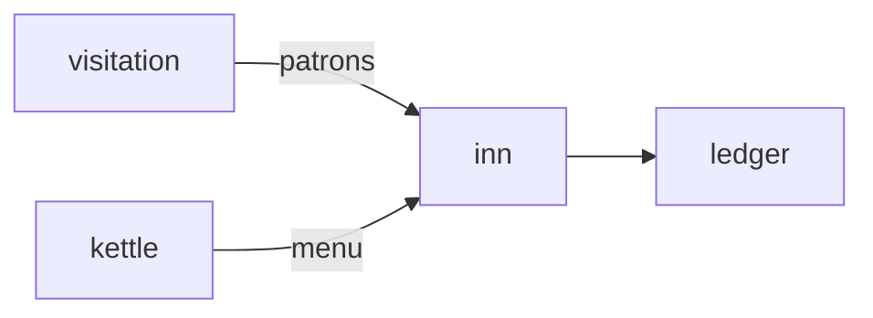

# Inn

**Pet Tavern Keep** — A planned tavern game where visiting pets become patrons and meals earn treats.

Part of [ComputerPets](https://github.com/RicheyWorks/computerpets). Map: [computerpets-ecosystem](https://github.com/RicheyWorks/computerpets-ecosystem).

[Status](#status) · [Design](docs/DESIGN.md) · [Contributor start](#contributor-start) · [Ecosystem](https://github.com/RicheyWorks/computerpets-ecosystem)

| Project | At a glance |
| --- | --- |
| Status | Design scaffold; not runnable yet |
| License | MIT |
| Tokens | Minigames never mint or burn. Tired overlay, not a dead lineage. |
| First pet | [Flagship start guide](https://github.com/RicheyWorks/computerpets/blob/main/docs/START-HERE.md) |

## Status

This repository contains a [design](docs/DESIGN.md) and a [source placeholder](src/Game.cs). It has no runnable application, build manifest, automated tests, or CI workflow.

The experience, interfaces, integrations, and safeguards below are **implementation plans**, not supported features. The first implementation slice defines the initial contribution target.

## Planned experience

Hearth is the village. Inn is the business on the square. Patrons are other players' pets (guests, not stolen). Tips in treats. A sleeping Rui is a bad barkeep.

## Intended audience

Hosts. Guests are Visitation pets, not stolen NFTs.

## Out of scope

A casino. Ballot lives elsewhere. Gambling tables are forbidden.

## Planned genre and engine

- Genre: **Business sim**
- Engine: **Unity**
- Stack: Unity 6 · C# · tavern loop · visiting pets as patrons · meals from Kettle
- Proposed surface: `Unity editor`

## Proposed integration



## Proposed play loop

1. Set menu + hours.
2. Seat guest pets. Serve biome-legal drinks.
3. Reviews affect tomorrow's traffic.
4. Close up → overlay pets clock out.

## First implementation slice

Initial implementation target:

**Open an hour, seat one guest, serve a biome-legal drink, tip in treats.**

Acceptance targets: Guest recalled: tip and vanish. Ledger down: IOU, settle later.

## Planned environment

Unity 6

## Planned safeguards

Guest pet recalled mid-sip → leave a tip and vanish. Ledger down → run on IOU, settle later. No gambling tables (Ballot is elsewhere).

Design constraints:

- 210 living kinds. No illegal hybrids.
- Overlay pets can get tired, sick, or hide. Tokens are not burned by a minigame.
- Desktop walk stays the main quest. Closing Inn must leave Rui walking.

## Related projects

- [computerpets-visitation](https://github.com/RicheyWorks/computerpets-visitation)
- [computerpets-hearth](https://github.com/RicheyWorks/computerpets-hearth)
- [computerpets-kettle](https://github.com/RicheyWorks/computerpets-kettle)
- [computerpets-ledger](https://github.com/RicheyWorks/computerpets-ledger)
- [computerpets-discord](https://github.com/RicheyWorks/computerpets-discord) (nightly last-call)

## Layout

```
computerpets-inn/
  README.md
  LICENSE
  docs/DESIGN.md
  src/                implementation lands here
```

## Contributor start

With Git and PowerShell, clone the scaffold and read its design and source marker:

```powershell
git clone https://github.com/RicheyWorks/computerpets-inn.git
Set-Location computerpets-inn
Get-Content .\docs\DESIGN.md
Get-Content .\src\Game.cs
```

Start with the [first implementation slice](#first-implementation-slice). Add the minimum project setup and tests needed for that slice, then document verified run commands. The proposed stack above is a design choice; there is no install or launch command for this checkout yet.

## Links

- Flagship: [RicheyWorks/computerpets](https://github.com/RicheyWorks/computerpets)
- This repo: [RicheyWorks/computerpets-inn](https://github.com/RicheyWorks/computerpets-inn)
- Map: [RicheyWorks/computerpets-ecosystem](https://github.com/RicheyWorks/computerpets-ecosystem)
- Design file: [docs/DESIGN.md](docs/DESIGN.md)

## License

MIT. See [LICENSE](LICENSE).

---

*Two hundred ten living kinds. Keep them so a line does not go quiet.*
