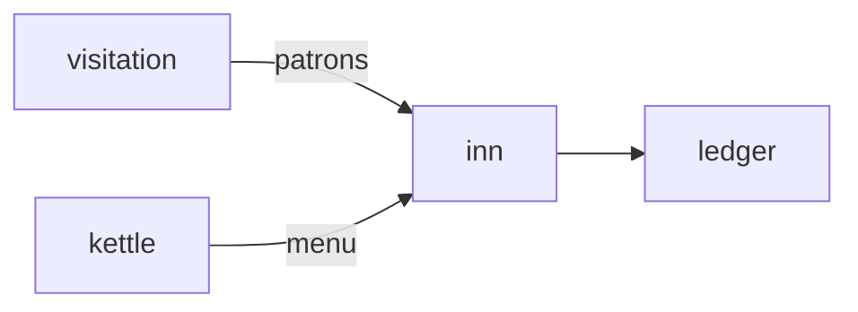

# Inn

**Pet Tavern Keep** — Run a cozy pub for traveling virtual pets — visitors from Visitation sit and sip.

Part of [ComputerPets](https://github.com/RicheyWorks/computerpets). Map: [computerpets-ecosystem](https://github.com/RicheyWorks/computerpets-ecosystem).

| | |
| --- | --- |
| Status | Design scaffold — loop and engine frozen |
| License | MIT |
| Tokens | Minigames never mint or burn. Tired overlay, not a dead lineage. |
| First pet | [Meet Rui first](https://github.com/RicheyWorks/computerpets/blob/main/docs/START-HERE.md). This game is optional. |

## The loop

Hearth is the village. Inn is the business on the square. Patrons are other players' pets (guests, not stolen). Tips in treats. A sleeping Rui is a bad barkeep.

## Who plays

Hosts. Guests are Visitation pets, not stolen NFTs.

## What it is not

A casino. Ballot lives elsewhere. Gambling tables are forbidden.

## Genre and engine

- Genre: **Business sim**
- Engine: **Unity**
- Stack: Unity 6 · C# · tavern loop · visiting pets as patrons · meals from Kettle
- Default surface: `Unity editor`

## Architecture



## How you play

1. Set menu + hours.
2. Seat guest pets. Serve biome-legal drinks.
3. Reviews affect tomorrow's traffic.
4. Close up → overlay pets clock out.

## First slice

Build this and stop.

**Open an hour, seat one guest, serve a biome-legal drink, tip in treats.**

You know it works when: Guest recalled: tip and vanish. Ledger down: IOU, settle later.

## Environment

Unity 6

## Failure doctrine

Guest pet recalled mid-sip → leave a tip and vanish. Ledger down → run on IOU, settle later. No gambling tables (Ballot is elsewhere).

Canon rules that never yield:

- 210 living kinds. No illegal hybrids.
- Overlay pets can get tired, sick, or hide. Tokens are not burned by a minigame.
- Desktop walk stays the main quest. Closing Inn must leave Rui walking.

## Neighbors

- computerpets-visitation
- computerpets-hearth
- computerpets-kettle
- computerpets-ledger
- computerpets-discord (nightly last-call)

## Layout

```
computerpets-inn/
  README.md
  LICENSE
  docs/DESIGN.md
  src/                implementation lands here
```

## Run (Windows)

```powershell
Unity Hub > Inn/; play mode.
```

Meet Rui first via the [flagship start-here](https://github.com/RicheyWorks/computerpets/blob/main/docs/START-HERE.md). This game is optional.

## Links

- Flagship: [RicheyWorks/computerpets](https://github.com/RicheyWorks/computerpets)
- This repo: [RicheyWorks/computerpets-inn](https://github.com/RicheyWorks/computerpets-inn)
- Map: [RicheyWorks/computerpets-ecosystem](https://github.com/RicheyWorks/computerpets-ecosystem)
- Design file: [docs/DESIGN.md](docs/DESIGN.md)

## License

MIT. See [LICENSE](LICENSE).

---

*Two hundred ten living kinds. Keep them so a line does not go quiet.*
